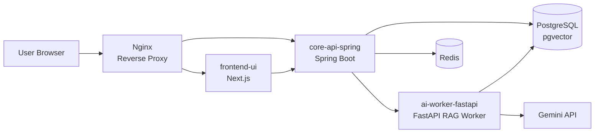

# notebooklm-clone-scj

NotebookLM 스타일의 멀티서비스 AI 문서 분석 프로젝트입니다.

PDF를 업로드하면 문서를 요약하고, 노트북 단위로 질문하면 관련 문서 청크를 검색해 근거와 함께 답변합니다. 단순한 LLM 호출이 아니라 `Spring Boot` 도메인 API, `FastAPI` RAG Worker, `Next.js` UI, `PostgreSQL + pgvector`, `Redis`, `Docker Compose`를 분리해 실제 서비스 구조에 가깝게 구성했습니다.

## 핵심 기능

| 기능 | 설명 |
| --- | --- |
| PDF 업로드 및 비동기 분석 | Spring이 문서 상태를 관리하고 FastAPI가 PDF 파싱, 요약, 임베딩 저장을 수행합니다. |
| 노트북 단위 RAG 채팅 | `notebook_id` 기준으로 검색 범위를 제한해 다른 노트북 문서가 섞이지 않도록 했습니다. |
| 고도화된 Retrieval | MMR, 로컬 reranker, dense + keyword hybrid search를 조합해 검색 품질을 개선했습니다. |
| 근거 추적 | 답변마다 reference chunk를 저장하고 문서명, 섹션명, 페이지, 청크 위치를 UI에 표시합니다. |
| Conversation Memory | 오래된 대화는 구조화된 summary memory로 압축하고 최근 대화는 raw history로 유지합니다. |
| 운영 관측성 | requestId, AI 호출 로그, latency, reference count를 저장해 요청 흐름을 추적합니다. |
| 인증/인가 | Spring Security, JWT, Redis 기반 refresh token rotation을 사용합니다. |

## 아키텍처



## RAG 처리 흐름

```txt
PDF 업로드
  -> 문서 상태 PROCESSING 저장
  -> PDF 텍스트 추출
  -> 문서 요약 생성
  -> 섹션/문단 기반 chunking
  -> metadata + embedding 저장
  -> 문서 상태 COMPLETED 갱신

채팅 질문
  -> notebook_id로 검색 범위 제한
  -> dense MMR 검색 + keyword 검색
  -> 로컬 reranker로 후보 재정렬
  -> 상위 reference chunk를 프롬프트에 구성
  -> LLM 답변 생성
  -> answer + reference metadata 저장/표시
```

## 저장소 구성

| Repository | 역할 |
| --- | --- |
| `frontend-ui` | Next.js 기반 사용자 화면, API route proxy, 채팅/근거 UI |
| `core-api-spring` | 인증, 노트북, 문서, 채팅, AI 호출 로그, reference 저장 |
| `ai-worker-fastapi` | PDF 파싱, 요약, chunking, embedding, retrieval, RAG 답변 생성 |
| `infra-config` | Docker Compose, Nginx, 배포 설정, 아키텍처 문서 |

## 기술 스택

| 영역 | 기술 |
| --- | --- |
| Frontend | Next.js, React, TypeScript |
| Backend | Spring Boot, Spring Security, JPA |
| AI Worker | FastAPI, LangChain, Gemini |
| Database | PostgreSQL, pgvector |
| Cache/Auth | Redis |
| Infra | Docker Compose, Nginx |

## 포트폴리오 포인트

- 멀티레포 구조로 UI, 도메인 API, AI Worker, 인프라 책임을 분리했습니다.
- RAG 검색 범위를 노트북 단위로 제한해 멀티테넌트 문서 혼선을 줄였습니다.
- MMR, reranker, hybrid search를 단계적으로 추가해 검색 품질 개선 과정을 설명할 수 있습니다.
- 답변 근거를 DB에 저장하고 UI에서 다시 펼쳐볼 수 있어 RAG explainability를 강화했습니다.
- 수동 평가셋과 scorecard를 만들어 retrieval/answer 품질을 감으로만 판단하지 않도록 했습니다.
- AI 호출 로그와 requestId를 남겨 장애 분석과 운영 관측성을 고려했습니다.

## 실행 문서

각 서비스의 실행 방법과 환경 변수는 저장소별 README를 기준으로 확인합니다.

- `frontend-ui/README.md`
- `core-api-spring/README.md`
- `ai-worker-fastapi/README.md`
- `infra-config/README.md`

## 현재 한계와 개선 방향

| 항목 | 설명 |
| --- | --- |
| PDF 텍스트 정제 | 일부 PDF는 텍스트 추출 결과의 공백이 붙어 reference 원문 가독성이 낮을 수 있습니다. |
| 스트리밍 응답 | 현재는 완성된 답변을 한 번에 반환하며, SSE 스트리밍은 추후 확장 대상입니다. |
| PDF 하이라이트 | 페이지/청크 metadata는 저장하지만 PDF 좌표 기반 하이라이트는 아직 구현하지 않았습니다. |
| 자동 평가 | 현재는 수동 평가셋 중심이며, 자동화된 RAG 평가 파이프라인은 추후 개선 대상입니다. |
