# notebooklm-clone-scj

NotebookLM 스타일의 멀티서비스 AI 문서 분석 및 질의응답 프로젝트입니다.  
PDF 업로드, 비동기 요약, 벡터 검색, 근거 기반 채팅, JWT 인증 구조를 하나의 서비스 흐름으로 구성했습니다.

## Architecture

  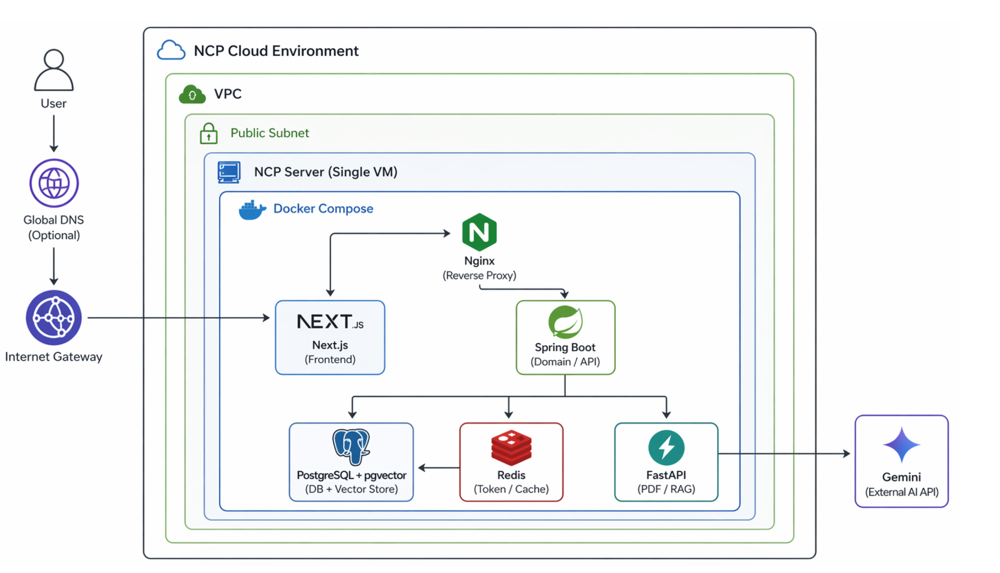

## Repositories

- [frontend-ui](https://github.com/notebooklm-clone-scj/frontend-ui) - Next.js 기반 사용자 인터페이스
- [core-api-spring](https://github.com/notebooklm-clone-scj/core-api-spring) - 메인 비즈니스 로직 및 사용자 API
- [ai-worker-fastapi](https://github.com/notebooklm-clone-scj/ai-worker-fastapi) - PDF 파싱, 임베딩, 유사도 검색, LLM 연동
- [infra-config](https://github.com/notebooklm-clone-scj/infra-config) - Docker Compose, Nginx, 배포 및 아키텍처 문서

## Features

- PDF 업로드 및 비동기 문서 분석
- 문서 요약 생성
- 노트북 단위 문서 기반 채팅
- AI 답변 근거 저장 및 재조회
- JWT + Redis 기반 인증/재발급
- PostgreSQL + pgvector 기반 벡터 검색

## Screens

### Authentication

  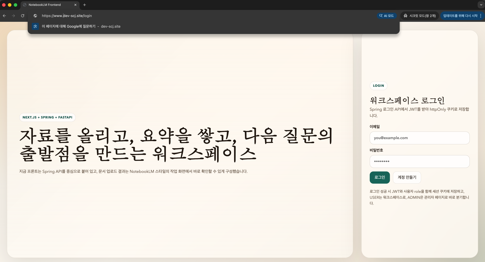

### Workspace

  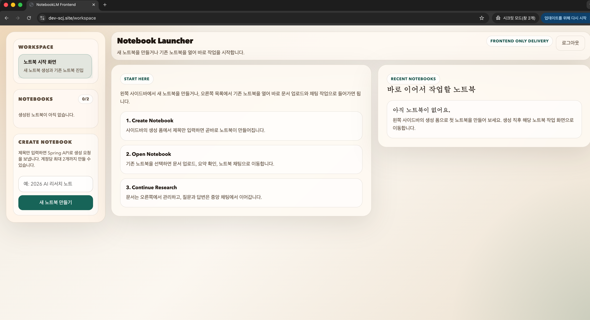

### Notebook

  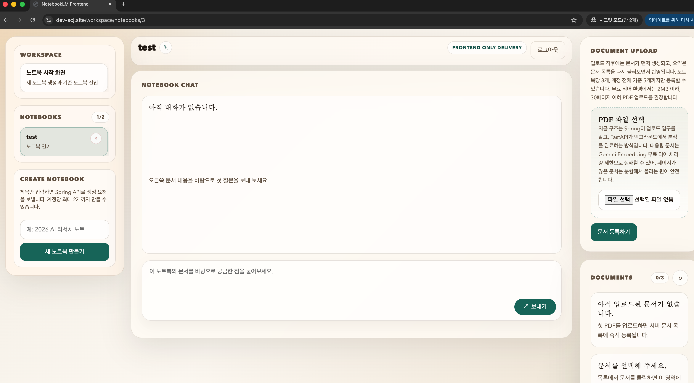

### Document Upload

  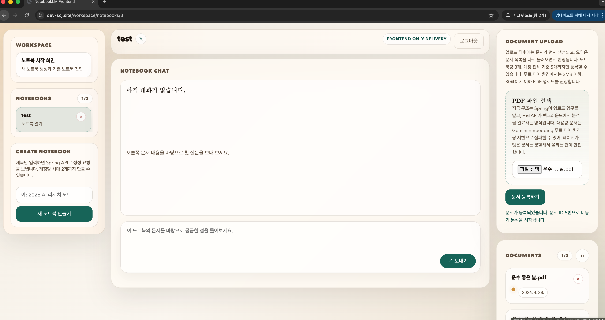

  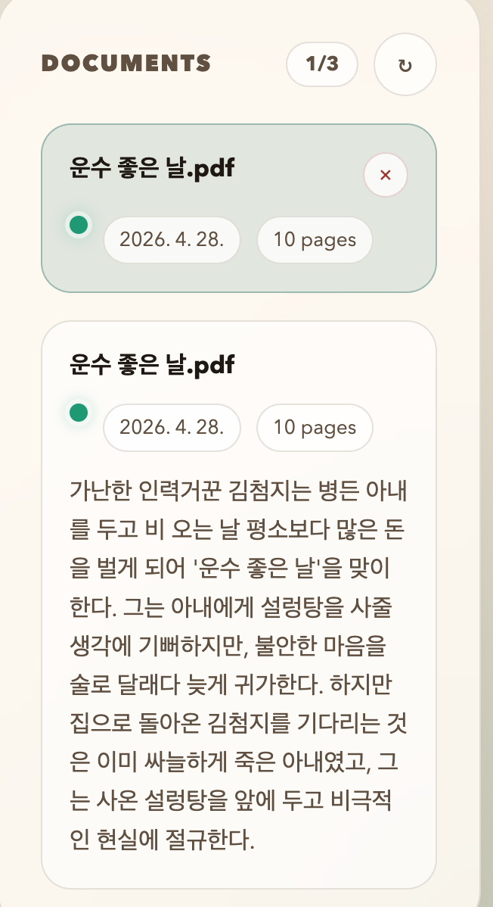

### Chat Experience

  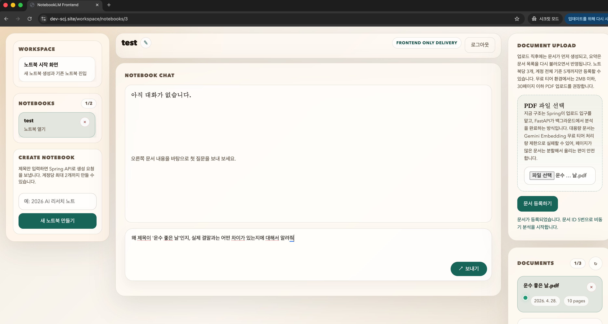
  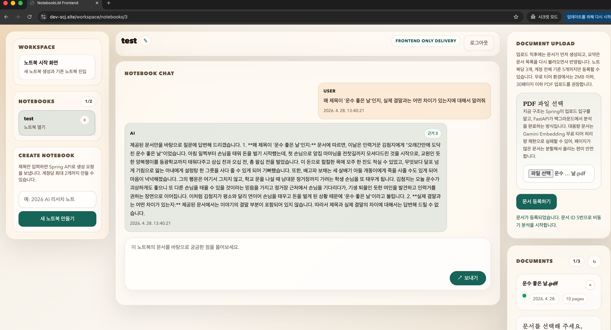

  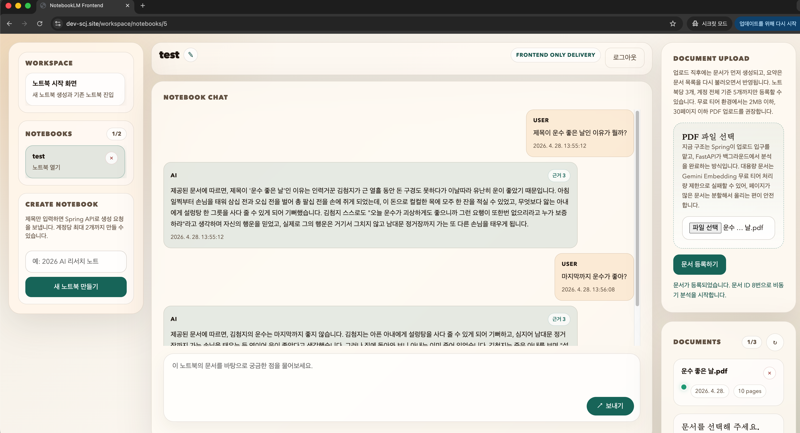
  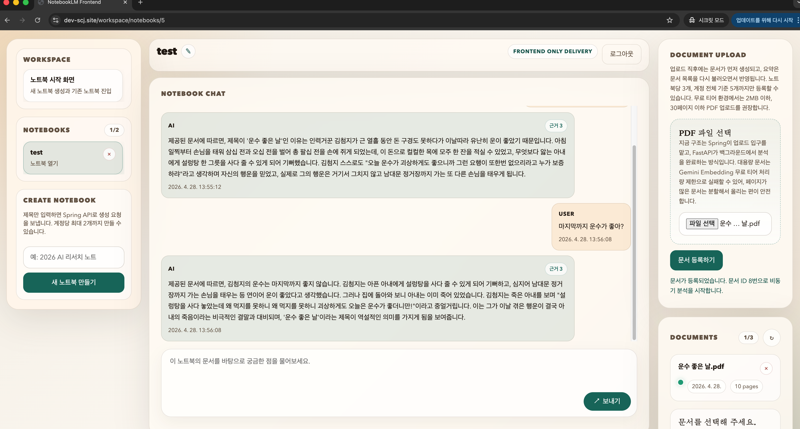

### Admin

  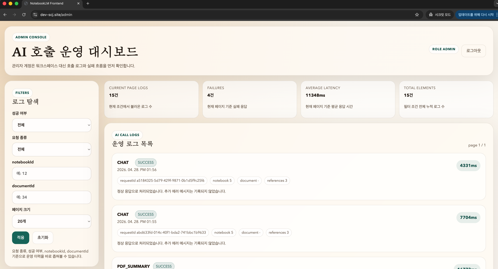
  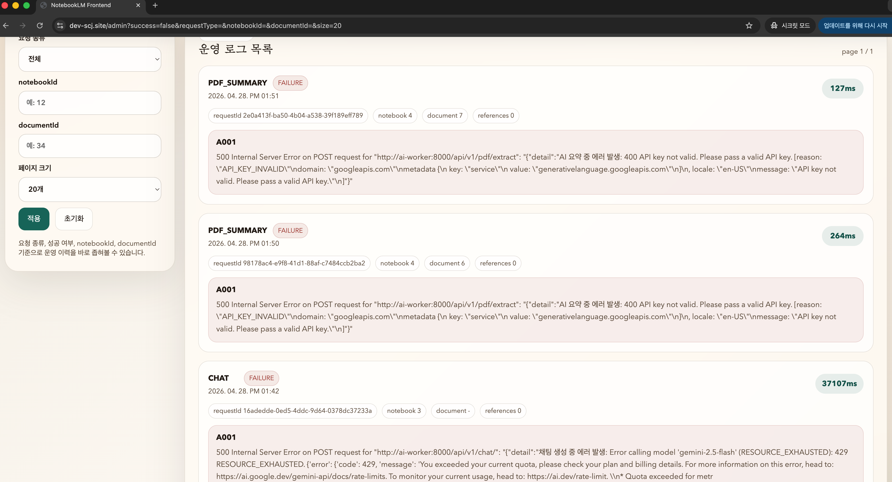

  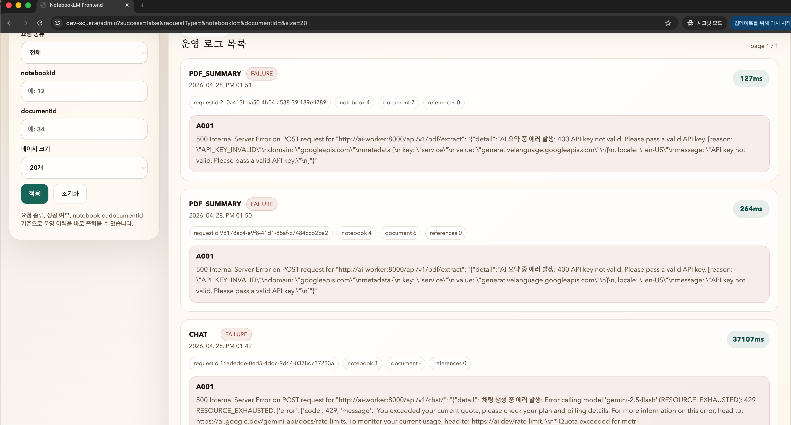

## Service Flow

1. 사용자가 프론트엔드에서 PDF를 업로드합니다.
2. Spring API가 문서 메타데이터를 저장하고 AI Worker 작업을 시작합니다.
3. AI Worker가 PDF 텍스트 추출, 요약 생성, 임베딩 저장을 수행합니다.
4. 사용자가 질문하면 AI Worker가 pgvector에서 관련 청크를 검색합니다.
5. Gemini 기반 답변과 근거를 생성하고, Spring API가 이를 저장합니다.

## Tech Stack

- Frontend: Next.js, TypeScript
- Backend: Spring Boot, JPA, Spring Security, JWT
- AI Worker: FastAPI, LangChain, Gemini
- Data: PostgreSQL, pgvector, Redis
- Infra: Docker Compose, Nginx, Naver Cloud Platform

## Deployment

운영 실행 방법, 환경 변수 설정, Docker Compose 기반 배포 방법은  
[infra-config 저장소](https://github.com/notebooklm-clone-scj/infra-config)에서 확인할 수 있습니다.
